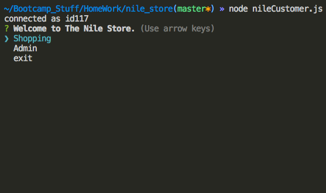
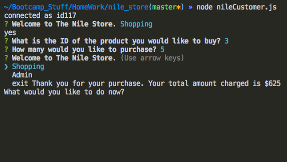
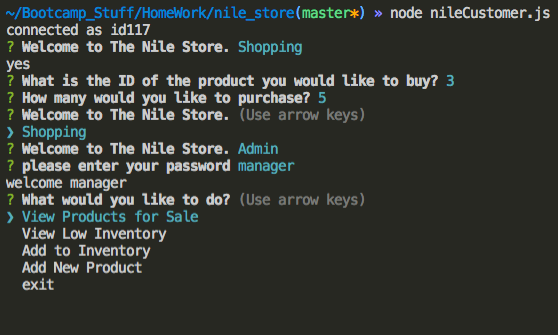
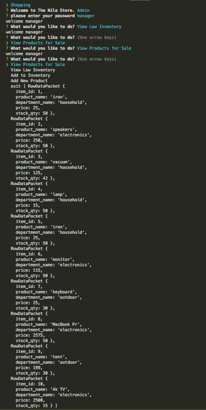

# nile_store
nile > amazon

This is a command line application that allows for a user to purchase items in stock.

Managers can look to see what items are available, have low stock, create new items, and update stock quantiy of existing items.

